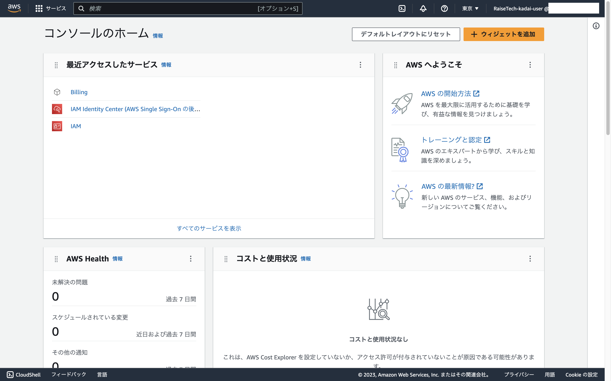
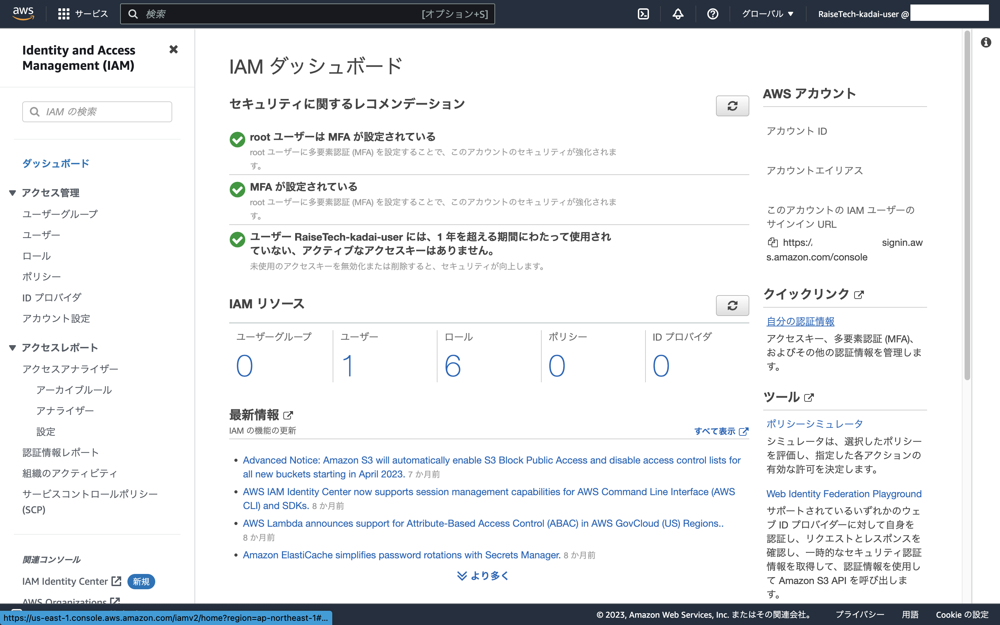
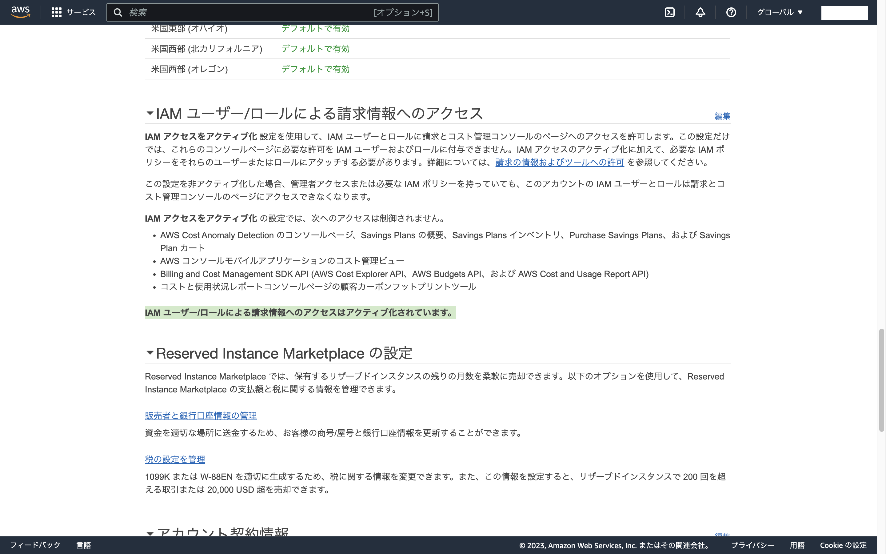
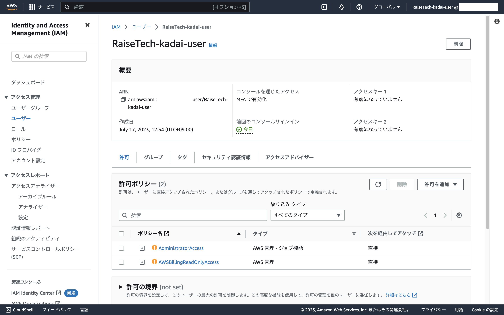
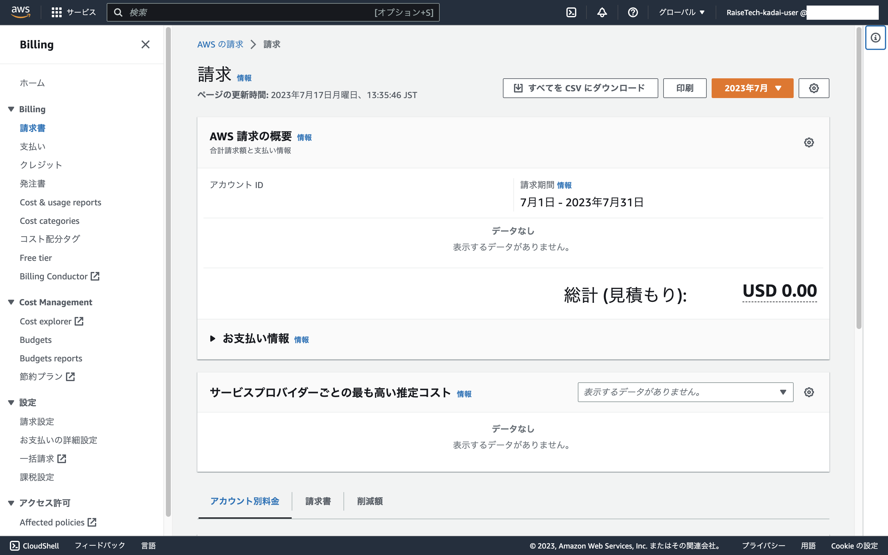
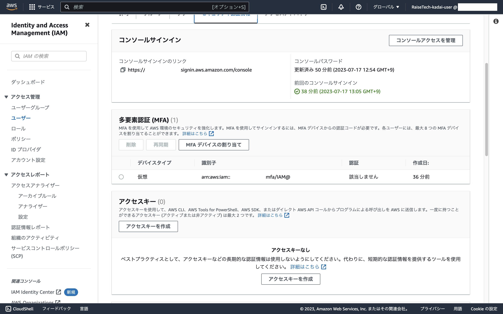

## **(1)AWS アカウントを作成してください。**

## **(2)IAM の推奨設定**
- ルートユーザーを MFA で保護してください。

---------------------------------------
- Billing を IAM ユーザーで閲覧できるようにしてください

---------------------------------------
- AdministratorAccess 権限の IAM ユーザーを作成して、以後この情報を使うようにしてください。

---------------------------------------
- 上記のIAMユーザーも同じく MFA で保護してください。

## **(3)Cloud9 の作成**

